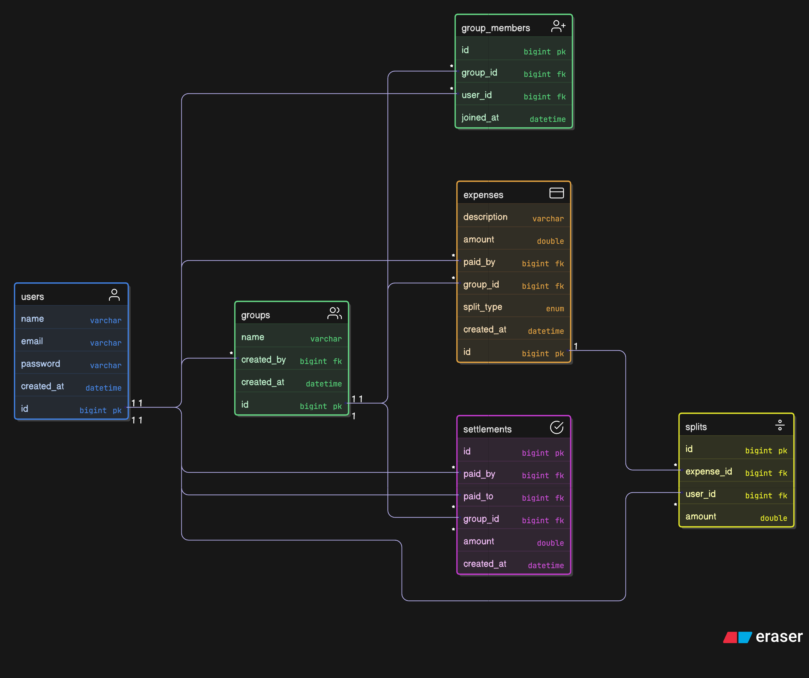

# ER Diagram

## Tables

Here's how the database is structured. Using MySQL.

## Table Descriptions

### users
Stores registered users. Email is unique so no duplicate accounts.

### groups
Each group has a name and a creator. Like "Goa Trip" or "Flat Rent".

### group_members
Junction table for the many-to-many relationship between users and groups.  
A user can be in multiple groups, and a group has multiple members.

### expenses
Each expense belongs to a group. Stores who paid, how much, what it was for, and the split type (EQUAL, EXACT, PERCENTAGE).

### splits
After an expense is added, this table stores how much each member owes for that expense.  
For example, if a ₹300 expense is split equally among 3 people, there will be 3 rows here with ₹100 each.

### settlements
When someone pays back, we record it here. This helps update the balance between two people in a group.
