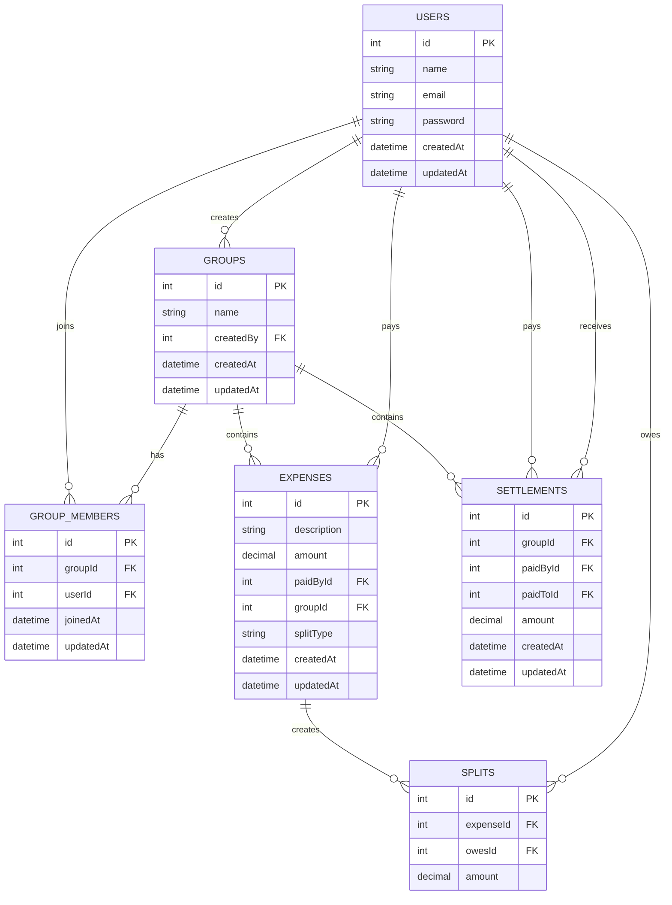

# ER Diagram

```mermaid
erDiagram
    USERS ||--o{ GROUP_MEMBERS : joins
    GROUPS ||--o{ GROUP_MEMBERS : has
    USERS ||--o{ GROUPS : creates
    GROUPS ||--o{ EXPENSES : contains
    USERS ||--o{ EXPENSES : pays
    EXPENSES ||--o{ SPLITS : creates
    USERS ||--o{ SPLITS : owes
    GROUPS ||--o{ SETTLEMENTS : contains
    USERS ||--o{ SETTLEMENTS : pays
    USERS ||--o{ SETTLEMENTS : receives

    USERS {
      int id PK
      string name
      string email
      string password
      datetime createdAt
      datetime updatedAt
    }

    GROUPS {
      int id PK
      string name
      int createdBy FK
      datetime createdAt
      datetime updatedAt
    }

    GROUP_MEMBERS {
      int id PK
      int groupId FK
      int userId FK
      datetime joinedAt
      datetime updatedAt
    }

    EXPENSES {
      int id PK
      string description
      decimal amount
      int paidById FK
      int groupId FK
      string splitType
      datetime createdAt
      datetime updatedAt
    }

    SPLITS {
      int id PK
      int expenseId FK
      int owesId FK
      decimal amount
    }

    SETTLEMENTS {
      int id PK
      int groupId FK
      int paidById FK
      int paidToId FK
      decimal amount
      datetime createdAt
      datetime updatedAt
    }
```

## Notes

- `group_members` handles the many to many relation between users and groups.
- `expenses` stores the main payment record.
- `splits` stores how much each user owes for one expense.
- `settlements` stores payback records between two users inside a group.
