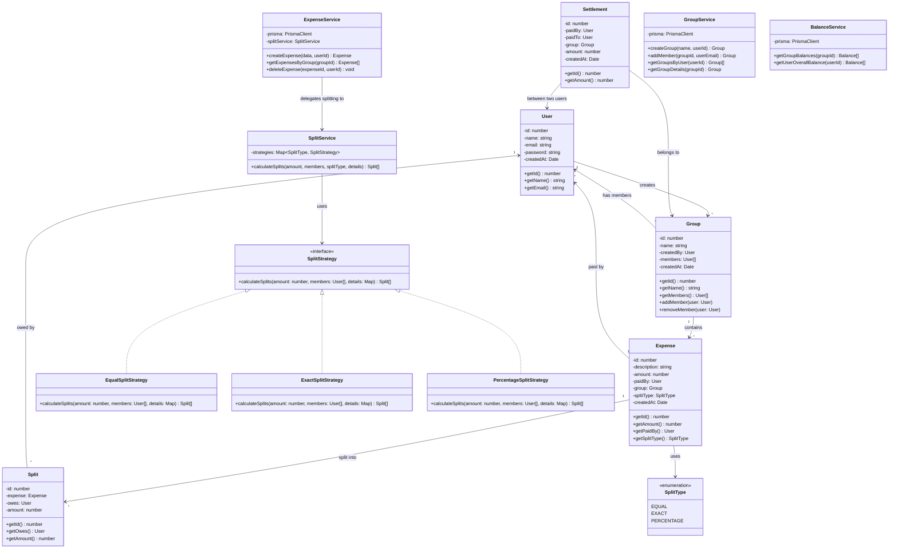

# Class Diagram

## Overview

Even though we're using Next.js (TypeScript), we still follow OOP principles.  
The backend uses a layered approach — API Route → Service → Prisma (database).  
Business logic lives in Service classes, and we use the Strategy pattern for splitting.



## Design Patterns Used

### Strategy Pattern (for splitting)

Instead of writing a big if-else block to handle different split types, I'm using the **Strategy Pattern**.  
There's a `SplitStrategy` interface, and each split type (Equal, Exact, Percentage) has its own class that implements it.  
This way, adding a new split type later is easy — just create a new class.

### Repository Pattern (via Prisma)

Prisma acts as our data access layer. It handles all the database queries.  
We don't write raw SQL — Prisma generates type-safe queries from our schema.

### Service Layer

Business logic stays in Service classes (not in API routes). API routes only handle HTTP stuff (parsing request, sending response) and pass things to the service.

## Project Structure (how files are organized)

```
/app
  /api
    /auth/         → login, register routes
    /groups/       → group CRUD routes
    /expenses/     → expense routes
    /settlements/  → settle up routes
  /dashboard/      → dashboard page
  /groups/         → group pages
/lib
  /services/       → ExpenseService, GroupService, etc.
  /strategies/     → SplitStrategy classes
  /middleware/     → auth middleware
  /types/          → TypeScript interfaces
/prisma
  schema.prisma    → database schema
```
