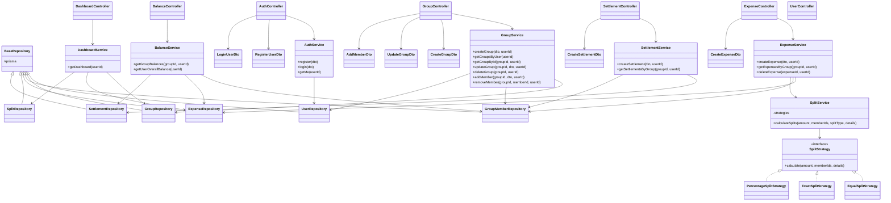

# Class Diagram

```mermaid
classDiagram
    class BaseRepository {
      #prisma
    }

    class UserRepository
    class GroupRepository
    class GroupMemberRepository
    class ExpenseRepository
    class SplitRepository
    class SettlementRepository

    BaseRepository <|-- UserRepository
    BaseRepository <|-- GroupRepository
    BaseRepository <|-- GroupMemberRepository
    BaseRepository <|-- ExpenseRepository
    BaseRepository <|-- SplitRepository
    BaseRepository <|-- SettlementRepository

    class AuthService {
      +register(dto)
      +login(dto)
      +getMe(userId)
    }

    class GroupService {
      +createGroup(dto, userId)
      +getGroupsByUser(userId)
      +getGroupById(groupId, userId)
      +updateGroup(groupId, dto, userId)
      +deleteGroup(groupId, userId)
      +addMember(groupId, dto, userId)
      +removeMember(groupId, memberId, userId)
    }

    class ExpenseService {
      +createExpense(dto, userId)
      +getExpensesByGroup(groupId, userId)
      +deleteExpense(expenseId, userId)
    }

    class BalanceService {
      +getGroupBalances(groupId, userId)
      +getUserOverallBalance(userId)
    }

    class SettlementService {
      +createSettlement(dto, userId)
      +getSettlementsByGroup(groupId, userId)
    }

    class DashboardService {
      +getDashboard(userId)
    }

    class AuthController
    class GroupController
    class ExpenseController
    class BalanceController
    class SettlementController
    class DashboardController
    class UserController

    class RegisterUserDto
    class LoginUserDto
    class CreateGroupDto
    class UpdateGroupDto
    class AddMemberDto
    class CreateExpenseDto
    class CreateSettlementDto

    class SplitService {
      -strategies
      +calculateSplits(amount, memberIds, splitType, details)
    }

    class SplitStrategy {
      <<interface>>
      +calculate(amount, memberIds, details)
    }

    class EqualSplitStrategy
    class ExactSplitStrategy
    class PercentageSplitStrategy

    SplitStrategy <|.. EqualSplitStrategy
    SplitStrategy <|.. ExactSplitStrategy
    SplitStrategy <|.. PercentageSplitStrategy
    SplitService --> SplitStrategy

    AuthController --> AuthService
    GroupController --> GroupService
    ExpenseController --> ExpenseService
    BalanceController --> BalanceService
    SettlementController --> SettlementService
    DashboardController --> DashboardService

    AuthService --> UserRepository
    GroupService --> GroupRepository
    GroupService --> GroupMemberRepository
    GroupService --> UserRepository
    ExpenseService --> ExpenseRepository
    ExpenseService --> GroupMemberRepository
    ExpenseService --> SplitService
    BalanceService --> GroupMemberRepository
    BalanceService --> ExpenseRepository
    BalanceService --> SettlementRepository
    SettlementService --> SettlementRepository
    SettlementService --> GroupMemberRepository
    DashboardService --> GroupRepository
    DashboardService --> ExpenseRepository
    DashboardService --> SplitRepository

    AuthController --> RegisterUserDto
    AuthController --> LoginUserDto
    GroupController --> CreateGroupDto
    GroupController --> UpdateGroupDto
    GroupController --> AddMemberDto
    ExpenseController --> CreateExpenseDto
    SettlementController --> CreateSettlementDto
```

## Notes

- Routes are thin and only call controller methods.
- Controllers convert request data into DTO objects.
- Services handle business logic.
- Repositories keep database access in one place.
- Split calculation uses runtime strategy selection.
