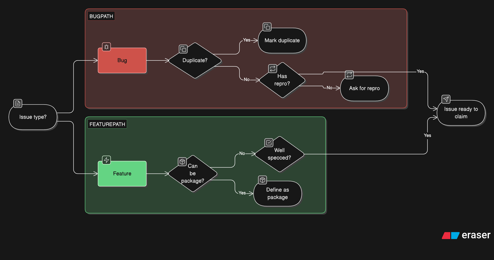

# Sequence Diagram — Main Flow (Adding an Expense)

This shows the end-to-end flow when a user adds an expense to a group.

## What's happening here

1. User fills the expense form on the frontend (a Next.js page)
2. Frontend sends a POST request — JWT is stored in an HTTP-only cookie
3. Auth middleware checks if the token is valid
4. The API route handler passes data to ExpenseService
5. ExpenseService validates the input and calls SplitService
6. SplitService figures out how much each person owes based on the split type
7. Prisma creates the expense and splits in one transaction in MySQL
8. Response goes back and the user sees the updated expense list
