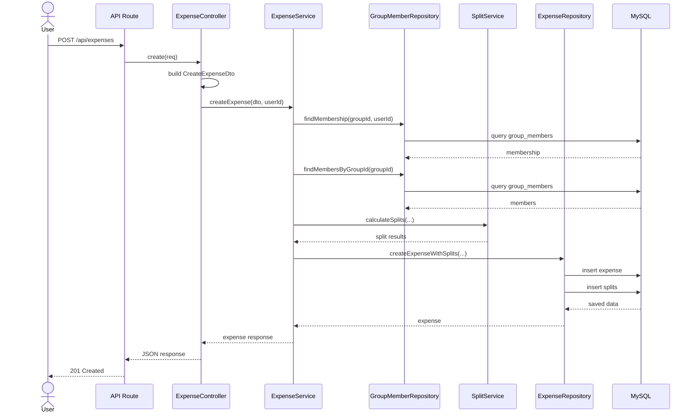

# Sequence Diagram

## Add expense flow

```mermaid
sequenceDiagram
    actor User
    participant Route as API Route
    participant Controller as ExpenseController
    participant Service as ExpenseService
    participant MemberRepo as GroupMemberRepository
    participant SplitService as SplitService
    participant ExpenseRepo as ExpenseRepository
    participant DB as MySQL

    User->>Route: POST /api/expenses
    Route->>Controller: create(req)
    Controller->>Controller: build CreateExpenseDto
    Controller->>Service: createExpense(dto, userId)
    Service->>MemberRepo: findMembership(groupId, userId)
    MemberRepo->>DB: query group_members
    DB-->>MemberRepo: membership
    Service->>MemberRepo: findMembersByGroupId(groupId)
    MemberRepo->>DB: query group_members
    DB-->>MemberRepo: members
    Service->>SplitService: calculateSplits(...)
    SplitService-->>Service: split results
    Service->>ExpenseRepo: createExpenseWithSplits(...)
    ExpenseRepo->>DB: insert expense
    ExpenseRepo->>DB: insert splits
    DB-->>ExpenseRepo: saved data
    ExpenseRepo-->>Service: expense
    Service-->>Controller: expense response
    Controller-->>Route: JSON response
    Route-->>User: 201 Created
```

## Why this flow is better

- Request validation starts in the DTO class
- Controller only handles request flow
- Service handles permission check and business logic
- Repository handles Prisma access
- Split logic stays isolated inside strategy classes
