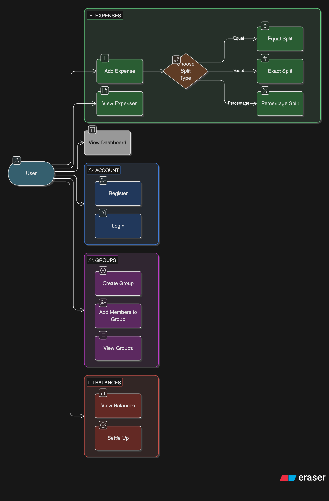

# Use Case Diagram

## Actors

- **User** — a registered person who can create groups, add expenses, settle up, etc.

## Diagram

## Use Case Descriptions

### UC1: Register
- User enters name, email, password
- System creates the account

### UC2: Login
- User enters email and password
- System verifies and returns a JWT token

### UC3: Create Group
- User gives a group name
- System creates the group with that user as the creator/member

### UC4: Add Members to Group
- User searches for other registered users by email
- Adds them to the group

### UC5: View Groups
- User sees all groups they are part of

### UC6: Add Expense
- User fills in: amount, description, who paid
- Selects split type (equal / exact / percentage)
- System calculates each person's share

### UC8: View Expenses
- User sees all expenses in a group with who paid and how it was split

### UC9: View Balances
- Shows how much user owes or is owed per group

### UC10: Settle Up
- User records a payment to another member
- System updates the balances

### UC11: View Dashboard
- Shows total balance, recent activity, group links
