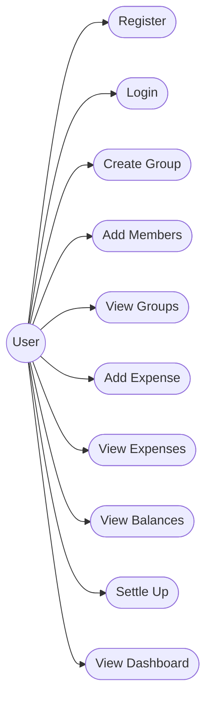

# Use Case Diagram

```mermaid
flowchart LR
    User((User))

    Register([Register])
    Login([Login])
    CreateGroup([Create Group])
    AddMembers([Add Members])
    ViewGroups([View Groups])
    AddExpense([Add Expense])
    ViewExpenses([View Expenses])
    ViewBalances([View Balances])
    SettleUp([Settle Up])
    ViewDashboard([View Dashboard])

    User --> Register
    User --> Login
    User --> CreateGroup
    User --> AddMembers
    User --> ViewGroups
    User --> AddExpense
    User --> ViewExpenses
    User --> ViewBalances
    User --> SettleUp
    User --> ViewDashboard
```

## Main use cases

1. Register and login
2. Create a group and manage members
3. Add expenses using one of the split types
4. See balances for a group
5. Record settlements
6. Check dashboard summary
